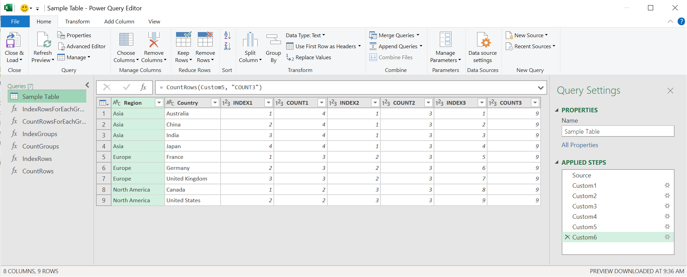

# PowerQuery-IndexRowsForEachGroup

[`English`](https://github.com/takeyamajp/PowerQuery-IndexRowsForEachGroup)  
`Japanese (日本語)`

もし有用なら、このリポジトリーにスターを付けていただけると励みになります。   

このライブラリーでは、正確に思った通りの並び順で連番を振ることが出来ます。  
さらに、このライブラリーは列の型を完全に保持します。

- [サンプルコード](#サンプルコード)
- [パラメータ説明](#パラメータ説明)
  - [table](#table)
  - [key](#key)
  - [comparisonCriteria](#comparisoncriteria)
  - [newColumnName](#newcolumnname)
- [カスタム関数（構文と定義）](#カスタム関数構文と定義)
  - [IndexRowsForEachGroup](#indexrowsforeachgroupグループ毎に指定した並び順で連番を振ります)
  - [CountRowsForEachGroup](#countrowsforeachgroupグループ毎の行数をカウントします)
  - [IndexGroups](#indexgroups指定した並び順でグループに連番を振ります)
  - [CountGroups](#countgroupsグループ数をカウントします)
  - [IndexRows](#indexrows各行に連番を振ります)
  - [CountRows](#countrows行数をカウントします)

# サンプルコード
[先にカスタム関数を登録しておいてください。](#カスタム関数構文と定義)  
このサンプルコードを実行するには、Power Query エディターで空のクエリを作成して、それを詳細エディターで開いてください。  
そして、既存のコードを以下のサンプル コードで置き換えてください。
~~~
let
    Source = #table(type table[Region = text, Country = text], {
        {"Asia", "Australia"}, 
        {"Asia", "China"}, 
        {"Asia", "India"}, 
        {"Asia", "Japan"}, 
        {"Europe", "France"}, 
        {"Europe", "Germany"}, 
        {"Europe", "United Kingdom"}, 
        {"North America", "Canada"}, 
        {"North America", "United States"}
    }),
    Custom1 = IndexRowsForEachGroup(Source, "Region", {"Region", "Country"}, "INDEX1"),
    Custom2 = CountRowsForEachGroup(Custom1, "Region", "COUNT1"),
    Custom3 = IndexGroups(Custom2, "Region", {"Region", "Country"}, "INDEX2"),
    Custom4 = CountGroups(Custom3, "Region", "COUNT2"),
    Custom5 = IndexRows(Custom4, {"Region", "Country"}, "INDEX3"),
    Custom6 = CountRows(Custom5, "COUNT3")
in
    Custom6
~~~

# パラメータ説明
### table
処理対象のテーブルを指定してください。

### key
指定したキーで処理するグループを判断します。

単一のキーを指定する場合。
`"Region"`

複数のキーを指定する場合。
`{"Region", "Country"}`

### comparisonCriteria
指定した条件で連番を振ります。

単一の列を指定する場合。
`"Region"` or `{{"Region", Order.Ascending}}`

複数の列を指定する場合。
`{"Region", "Country"}` or `{{"Region", Order.Ascending}, {"Country", Order.Descending}}`

### newColumnName
追加される列の名前です。省略した場合は `@INDEX` or `@COUNT` になります。

# カスタム関数（構文と定義）
カスタム関数を作成するには、Power Query エディターで空のクエリを作成して、以下の関数定義を数式バーに貼り付けてください。

### IndexRowsForEachGroup（グループ毎に、指定した並び順で連番を振ります。）
IndexRowsForEachGroup(`table` as table, `key` as anynonnull, `comparisonCriteria` as anynonnull, optional `newColumnName` as nullable text) as table
~~~
= (table as table, key as anynonnull, comparisonCriteria as anynonnull, optional newColumnName as nullable text) as table => Table.Sort(Table.TransformColumnTypes(Table.ExpandTableColumn(Table.SelectColumns(Table.AddColumn(Table.Group(table, key, {{"_GTABLE", each _}}), "_ITABLE", each Table.AddIndexColumn(Table.Sort([_GTABLE], comparisonCriteria), newColumnName ?? "@INDEX", 1, 1)), "_ITABLE"), "_ITABLE", Table.ColumnNames(table) & {newColumnName ?? "@INDEX"}, Table.ColumnNames(table) & {newColumnName ?? "@INDEX"}), Table.ToRows(Table.SelectColumns(Table.AddColumn(Table.Schema(table), "Type", each if [TypeName] = "Number.Type" then type number else if [TypeName] = "Currency.Type" then Currency.Type else if [TypeName] = "Int64.Type" then Int64.Type else if [TypeName] = "Percentage.Type" then Percentage.Type else if [TypeName] = "DateTime.Type" then type datetime else if [TypeName] = "Date.Type" then type date else if [TypeName] = "Time.Type" then type time else if [TypeName] = "DateTimeZone.Type" then type datetimezone else if [TypeName] = "Duration.Type" then type duration else if [TypeName] = "Text.Type" then type text else if [TypeName] = "Logical.Type" then type logical else if [TypeName] = "Binary.Type" then type binary else type any, type any), {"Name", "Type"})) & {{newColumnName ?? "@INDEX", Int64.Type}}), (if comparisonCriteria is list then comparisonCriteria else {comparisonCriteria}) & {newColumnName ?? "@INDEX"})
~~~

### CountRowsForEachGroup（グループ毎の行数をカウントします。）
CountRowsForEachGroup(`table` as table, `key` as anynonnull, optional `newColumnName` as nullable text) as table
~~~
= (table as table, key as anynonnull, optional newColumnName as nullable text) as table => Table.TransformColumnTypes(Table.ExpandTableColumn(Table.SelectColumns(Table.AddColumn(Table.Group(table, key, {{"_GTABLE", each _}}), newColumnName ?? "@COUNT", each Table.RowCount([_GTABLE]), Int64.Type), {"_GTABLE", newColumnName ?? "@COUNT"}), "_GTABLE", Table.ColumnNames(table), Table.ColumnNames(table)), Table.ToRows(Table.SelectColumns(Table.AddColumn(Table.Schema(table), "Type", each if [TypeName] = "Number.Type" then type number else if [TypeName] = "Currency.Type" then Currency.Type else if [TypeName] = "Int64.Type" then Int64.Type else if [TypeName] = "Percentage.Type" then Percentage.Type else if [TypeName] = "DateTime.Type" then type datetime else if [TypeName] = "Date.Type" then type date else if [TypeName] = "Time.Type" then type time else if [TypeName] = "DateTimeZone.Type" then type datetimezone else if [TypeName] = "Duration.Type" then type duration else if [TypeName] = "Text.Type" then type text else if [TypeName] = "Logical.Type" then type logical else if [TypeName] = "Binary.Type" then type binary else type any, type any), {"Name", "Type"})))
~~~

### IndexGroups（指定した並び順でグループに連番を振ります。）
IndexGroups(`table` as table, `key` as anynonnull, `comparisonCriteria` as anynonnull, optional `newColumnName` as nullable text) as table
~~~
= (table as table, key as anynonnull, comparisonCriteria as anynonnull, optional newColumnName as nullable text) as table => Table.Sort(Table.TransformColumnTypes(Table.ExpandTableColumn(Table.SelectColumns(Table.AddIndexColumn(Table.Sort(Table.Group(table, key, {{"_GTABLE", each _}}), List.Select((if comparisonCriteria is list then comparisonCriteria else {comparisonCriteria}) & (if key is list then key else {key}), each List.Contains(if key is list then key else {key}, if _ is list then _{0} else _))), newColumnName ?? "@INDEX", 1, 1, Int64.Type), {"_GTABLE", newColumnName ?? "@INDEX"}), "_GTABLE", Table.ColumnNames(table), Table.ColumnNames(table)), Table.ToRows(Table.SelectColumns(Table.AddColumn(Table.Schema(table), "Type", each if [TypeName] = "Number.Type" then type number else if [TypeName] = "Currency.Type" then Currency.Type else if [TypeName] = "Int64.Type" then Int64.Type else if [TypeName] = "Percentage.Type" then Percentage.Type else if [TypeName] = "DateTime.Type" then type datetime else if [TypeName] = "Date.Type" then type date else if [TypeName] = "Time.Type" then type time else if [TypeName] = "DateTimeZone.Type" then type datetimezone else if [TypeName] = "Duration.Type" then type duration else if [TypeName] = "Text.Type" then type text else if [TypeName] = "Logical.Type" then type logical else if [TypeName] = "Binary.Type" then type binary else type any, type any), {"Name", "Type"}))), (if comparisonCriteria is list then comparisonCriteria else {comparisonCriteria}) & {newColumnName ?? "@INDEX"})
~~~

### CountGroups（グループ数をカウントします。）
CountGroups(`table` as table, `key` as anynonnull, optional `newColumnName` as nullable text) as table
~~~
= (table as table, key as anynonnull, optional newColumnName as nullable text) as table => Table.AddColumn(table, newColumnName ?? "@COUNT", each Table.RowCount(Table.Group(table, key, {{"_GTABLE", each _}})), Int64.Type)
~~~

### IndexRows（各行に連番を振ります。）
IndexRows(`table` as table, `comparisonCriteria` as anynonnull, optional `newColumnName` as nullable text) as table
~~~
= (table as table, comparisonCriteria as anynonnull, optional newColumnName as nullable text) as table => Table.AddIndexColumn(Table.Sort(table, comparisonCriteria), newColumnName ?? "@INDEX", 1, 1, Int64.Type)
~~~

### CountRows（行数をカウントします。）
CountRows(`table` as table, optional `newColumnName` as nullable text) as table
~~~
= (table as table, optional newColumnName as nullable text) as table => Table.AddColumn(table, newColumnName ?? "@COUNT", each Table.RowCount(table), Int64.Type)
~~~
