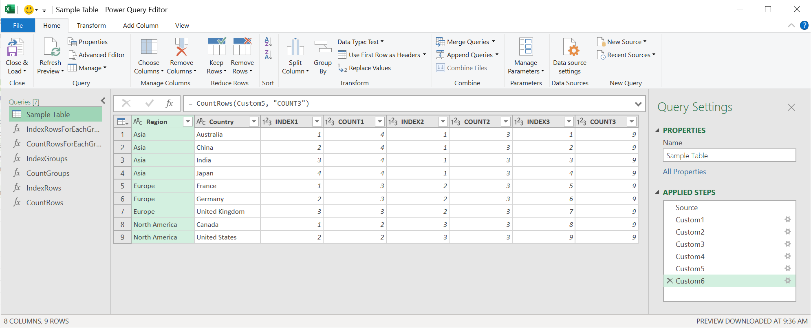

# PowerQuery-IndexRowsForEachGroup
`English`  
[`Japanese (日本語)`](https://github.com/takeyamajp/PowerQuery-IndexRowsForEachGroup/blob/main/README.ja.md)

Star this repository if it is useful for you.  

In this library, it is possible to assign sequential numbers in the exact and intended order.  
Also, This library fully preserves column types.

- [Sample Code](#sample-code)
- [Parameters](#parameters)
  - [table](#table)
  - [key](#key)
  - [comparisonCriteria](#comparisoncriteria)
  - [newColumnName](#newcolumnname)
- [Custom Functions (Syntax And Definition)](#custom-functions-syntax-and-definition)
  - [IndexRowsForEachGroup](#indexrowsforeachgroup)
  - [CountRowsForEachGroup](#countrowsforeachgroup)
  - [IndexGroups](#indexgroups)
  - [CountGroups](#countgroups)
  - [IndexRows](#indexrows)
  - [CountRows](#countrows)

# Sample Code
[Register the custom functions first.](#custom-functions-syntax-and-definition)  
To execute the sample code, create a Blank Query in Power Query Editor and open it in Advanced Editor.  
And replace the existing code with the code below.
~~~
let
    Source = #table(type table[Region = text, Country = text], {
        {"Asia", "Australia"}, 
        {"Asia", "China"}, 
        {"Asia", "India"}, 
        {"Asia", "Japan"}, 
        {"Europe", "France"}, 
        {"Europe", "Germany"}, 
        {"Europe", "United Kingdom"}, 
        {"North America", "Canada"}, 
        {"North America", "United States"}
    }),
    Custom1 = IndexRowsForEachGroup(Source, "Region", {"Region", "Country"}, "INDEX1"),
    Custom2 = CountRowsForEachGroup(Custom1, "Region", "COUNT1"),
    Custom3 = IndexGroups(Custom2, "Region", {"Region", "Country"}, "INDEX2"),
    Custom4 = CountGroups(Custom3, "Region", "COUNT2"),
    Custom5 = IndexRows(Custom4, {"Region", "Country"}, "INDEX3"),
    Custom6 = CountRows(Custom5, "COUNT3")
in
    Custom6
~~~

# Parameters
### table
The table to be processed.

### key
The specified key determines which group to process.

When specifying in a single key.  
`"Region"`

When specifying in multiple keys.  
`{"Region", "Country"}`

### comparisonCriteria
The index numbers are assigned in the specified order.

When specifying in a single column.  
`"Region"` or `{{"Region", Order.Ascending}}`

When specifying in multiple columns.  
`{"Region", "Country"}` or `{{"Region", Order.Ascending}, {"Country", Order.Descending}}`

### newColumnName
A new column is added with the specified name. If omitted, it will be `@INDEX` or `@COUNT`.

# Custom Functions (Syntax And Definition)
To create a custom function, create a Blank Query in Power Query Editor and paste the function definition below into Formula Bar.

### IndexRowsForEachGroup
IndexRowsForEachGroup(`table` as table, `key` as anynonnull, `comparisonCriteria` as anynonnull, optional `newColumnName` as nullable text) as table
~~~
= (table as table, key as anynonnull, comparisonCriteria as anynonnull, optional newColumnName as nullable text) as table => Table.Sort(Table.TransformColumnTypes(Table.ExpandTableColumn(Table.SelectColumns(Table.AddColumn(Table.Group(table, key, {{"_GTABLE", each _}}), "_ITABLE", each Table.AddIndexColumn(Table.Sort([_GTABLE], comparisonCriteria), newColumnName ?? "@INDEX", 1, 1)), "_ITABLE"), "_ITABLE", Table.ColumnNames(table) & {newColumnName ?? "@INDEX"}, Table.ColumnNames(table) & {newColumnName ?? "@INDEX"}), Table.ToRows(Table.SelectColumns(Table.AddColumn(Table.Schema(table), "Type", each if [TypeName] = "Number.Type" then type number else if [TypeName] = "Currency.Type" then Currency.Type else if [TypeName] = "Int64.Type" then Int64.Type else if [TypeName] = "Percentage.Type" then Percentage.Type else if [TypeName] = "DateTime.Type" then type datetime else if [TypeName] = "Date.Type" then type date else if [TypeName] = "Time.Type" then type time else if [TypeName] = "DateTimeZone.Type" then type datetimezone else if [TypeName] = "Duration.Type" then type duration else if [TypeName] = "Text.Type" then type text else if [TypeName] = "Logical.Type" then type logical else if [TypeName] = "Binary.Type" then type binary else type any, type any), {"Name", "Type"})) & {{newColumnName ?? "@INDEX", Int64.Type}}), (if comparisonCriteria is list then comparisonCriteria else {comparisonCriteria}) & {newColumnName ?? "@INDEX"})
~~~

### CountRowsForEachGroup
CountRowsForEachGroup(`table` as table, `key` as anynonnull, optional `newColumnName` as nullable text) as table
~~~
= (table as table, key as anynonnull, optional newColumnName as nullable text) as table => Table.TransformColumnTypes(Table.ExpandTableColumn(Table.SelectColumns(Table.AddColumn(Table.Group(table, key, {{"_GTABLE", each _}}), newColumnName ?? "@COUNT", each Table.RowCount([_GTABLE]), Int64.Type), {"_GTABLE", newColumnName ?? "@COUNT"}), "_GTABLE", Table.ColumnNames(table), Table.ColumnNames(table)), Table.ToRows(Table.SelectColumns(Table.AddColumn(Table.Schema(table), "Type", each if [TypeName] = "Number.Type" then type number else if [TypeName] = "Currency.Type" then Currency.Type else if [TypeName] = "Int64.Type" then Int64.Type else if [TypeName] = "Percentage.Type" then Percentage.Type else if [TypeName] = "DateTime.Type" then type datetime else if [TypeName] = "Date.Type" then type date else if [TypeName] = "Time.Type" then type time else if [TypeName] = "DateTimeZone.Type" then type datetimezone else if [TypeName] = "Duration.Type" then type duration else if [TypeName] = "Text.Type" then type text else if [TypeName] = "Logical.Type" then type logical else if [TypeName] = "Binary.Type" then type binary else type any, type any), {"Name", "Type"})))
~~~

### IndexGroups
IndexGroups(`table` as table, `key` as anynonnull, `comparisonCriteria` as anynonnull, optional `newColumnName` as nullable text) as table
~~~
= (table as table, key as anynonnull, comparisonCriteria as anynonnull, optional newColumnName as nullable text) as table => Table.Sort(Table.TransformColumnTypes(Table.ExpandTableColumn(Table.SelectColumns(Table.AddIndexColumn(Table.Sort(Table.Group(table, key, {{"_GTABLE", each _}}), List.Select((if comparisonCriteria is list then comparisonCriteria else {comparisonCriteria}) & (if key is list then key else {key}), each List.Contains(if key is list then key else {key}, if _ is list then _{0} else _))), newColumnName ?? "@INDEX", 1, 1, Int64.Type), {"_GTABLE", newColumnName ?? "@INDEX"}), "_GTABLE", Table.ColumnNames(table), Table.ColumnNames(table)), Table.ToRows(Table.SelectColumns(Table.AddColumn(Table.Schema(table), "Type", each if [TypeName] = "Number.Type" then type number else if [TypeName] = "Currency.Type" then Currency.Type else if [TypeName] = "Int64.Type" then Int64.Type else if [TypeName] = "Percentage.Type" then Percentage.Type else if [TypeName] = "DateTime.Type" then type datetime else if [TypeName] = "Date.Type" then type date else if [TypeName] = "Time.Type" then type time else if [TypeName] = "DateTimeZone.Type" then type datetimezone else if [TypeName] = "Duration.Type" then type duration else if [TypeName] = "Text.Type" then type text else if [TypeName] = "Logical.Type" then type logical else if [TypeName] = "Binary.Type" then type binary else type any, type any), {"Name", "Type"}))), (if comparisonCriteria is list then comparisonCriteria else {comparisonCriteria}) & {newColumnName ?? "@INDEX"})
~~~

### CountGroups
CountGroups(`table` as table, `key` as anynonnull, optional `newColumnName` as nullable text) as table
~~~
= (table as table, key as anynonnull, optional newColumnName as nullable text) as table => Table.AddColumn(table, newColumnName ?? "@COUNT", each Table.RowCount(Table.Group(table, key, {{"_GTABLE", each _}})), Int64.Type)
~~~

### IndexRows
IndexRows(`table` as table, `comparisonCriteria` as anynonnull, optional `newColumnName` as nullable text) as table
~~~
= (table as table, comparisonCriteria as anynonnull, optional newColumnName as nullable text) as table => Table.AddIndexColumn(Table.Sort(table, comparisonCriteria), newColumnName ?? "@INDEX", 1, 1, Int64.Type)
~~~

### CountRows
CountRows(`table` as table, optional `newColumnName` as nullable text) as table
~~~
= (table as table, optional newColumnName as nullable text) as table => Table.AddColumn(table, newColumnName ?? "@COUNT", each Table.RowCount(table), Int64.Type)
~~~
